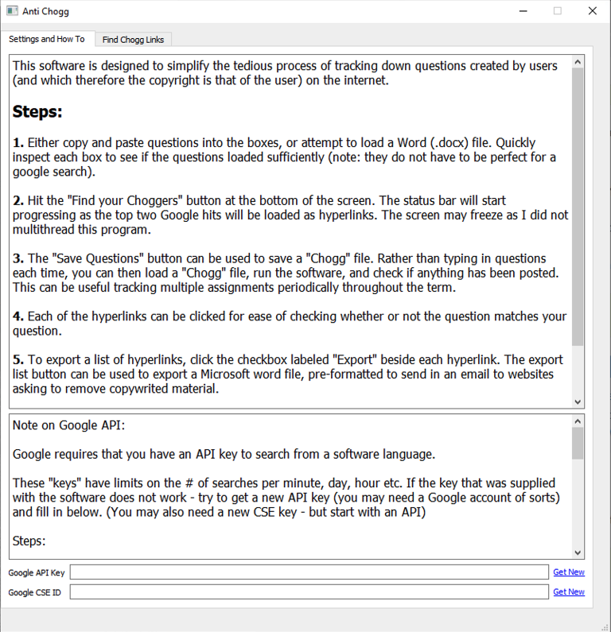
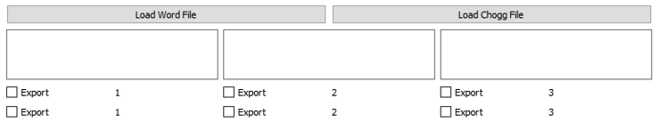
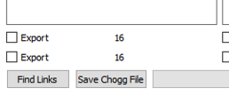
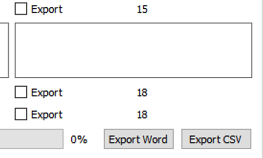

# Hit the donate button on the right if this code helps you out and you want to support my ongoing projects! -->

I currently am working on improvements for our graduate students researchers, including low-cost and multi-use dataloggers utilising Raspberry Pi's. 

<!-- TABLE OF CONTENTS -->
<details open="open">
  <summary><h2 style="display: inline-block">Table of Contents</h2></summary>
  <ol>
    <li>
      <a href="#about-the-project">About The Project</a>
      <ul>
        <li><a href="#built-with">Built With</a></li>
      </ul>
    </li>
    <li>
      <a href="#getting-started">Getting Started</a>
      <ul>
        <li><a href="#prerequisites">Prerequisites</a></li>
        <li><a href="#installation">Installation</a></li>
      </ul>
    </li>
    <li><a href="#usage">Usage</a></li>
    <li><a href="#contributing">Contributing</a></li>
    <li><a href="#license">License</a></li>
    <li><a href="#contact">Contact</a></li>
  </ol>
</details>


<!-- ABOUT THE PROJECT -->
## About The Project

This project was created to save time and energy scouring the web for posted assignments. Its intended use is to search out Copyright material developed by teachers, instructors, and professors. The coprighted material can then be requested to be taken down on common websites.


### Built With

* [Python]()
* [Pyside2]()


<!-- GETTING STARTED -->
## Getting Started

To get a local copy up and running follow these simple steps.

### Prerequisites

The main pre-requisite for this software is Python3. The following will also need to be installed

* docx
  ```sh
  pip install python-docx
  ```
* Pyside2
  ```sh
  pip install Pyside2
  ```
* Google API
  ```sh
  pip install google-api-python-client
  ```
* Beautiful Soup4
  ```sh
  pip install bs4
  ```

### Installation

1. Clone the repo
   ```sh
   git clone https://github.com/github_username/repo_name.git
   ```
2. Run the program from a command terminal
   ```sh
   python AntiChogg.py
   ```


<!-- USAGE EXAMPLES -->
## Usage

The first page of the software contains the instructions to set up a Google API key and a Custom Search engine, as well as some general functions of the program

_

The second page allows a user to do one of three things: Load a Word (.docx) file, load a "Chogg" file, or copy and past questions into the text boxes. The Word file loader will attempt to find questions in your assignment the best it can through sorting paragraphs from longest to shortest.

_

Clicking on the "Finding Links" button will return the top 2 google hits for each text box. Typically, if it is an original question, the first hit will be a site in which it has been posted for solutions.

# The biggest timesaver

Once you have your assignment questions loaded, hit the "Save Chogg File". This will allow you to save that particular assignment as a ".chogg" file, such that when you launch the program again, you can quickly load and search all those questions again. For example, if you post the assignment online, you could quickly load this file and search every day to see if any questions have been posted online

_

Once you have found your files online (you can click on hyperlinks), you can then export the links. Check the box beside each link you wish to export. Then, click either "Export Word" or "Export CSV". Some sites allow .csv files for large takedown requests. A Word file can be advantageous in information request letters for some sites.

_

<!-- CONTRIBUTING -->
## Contributing

Contributions are what make the open source community such an amazing place to be learn, inspire, and create. Any contributions you make are **greatly appreciated**.

1. Fork the Project
2. Create your Feature Branch (`git checkout -b feature/AmazingFeature`)
3. Commit your Changes (`git commit -m 'Add some AmazingFeature'`)
4. Push to the Branch (`git push origin feature/AmazingFeature`)
5. Open a Pull Request


<!-- LICENSE -->
## License

Distributed under the MIT License. See `LICENSE` for more information.


<!-- CONTACT -->
## Contact

antichogg@gmail.com
